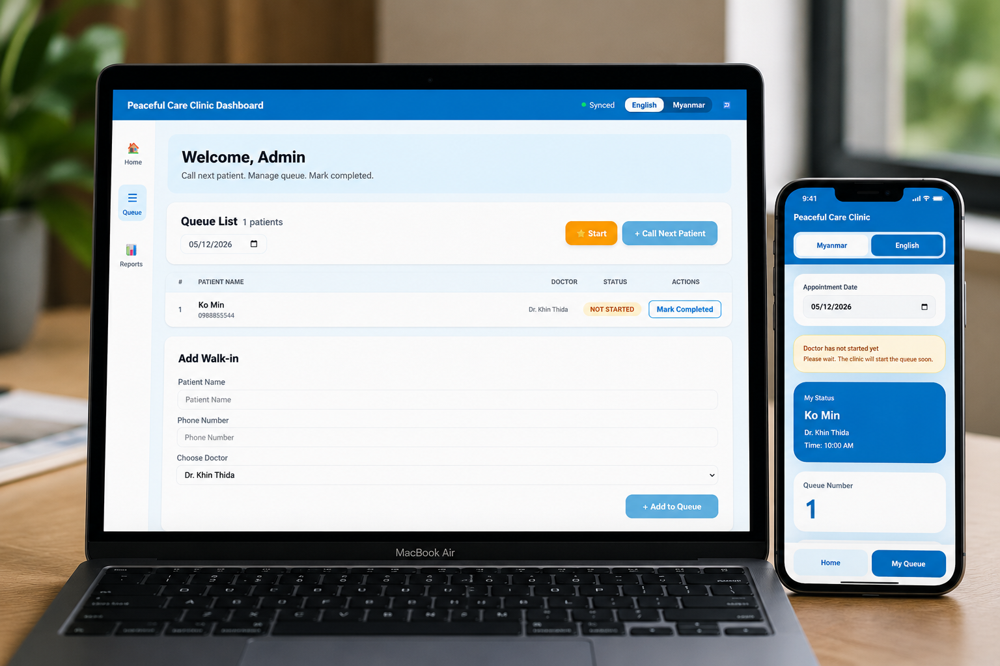
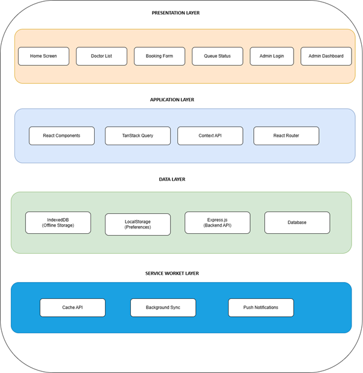
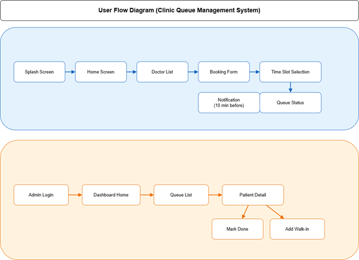

# Clinic Queue System 

## 📱 Project Overview

**This is a Final Year Project for the Bachelor of Science in Computing at the University of Roehampton.**

### The Problem

In Myanmar clinics, patients experience long waiting times without knowing their position in the queue. Clinic staff manage queues manually using paper tickets, causing confusion, inefficiency, and patient frustration.

Existing healthcare apps in Myanmar (Careme Patient, YatChainYou, MyanCare, Say-Ku) have critical gaps:
- ❌ No offline support
- ❌ No patient-facing queue tracking
- ❌ No walk-in patient management
- ❌ No admin dashboard for clinics

### The Solution

A **Progressive Web Application (PWA)** that allows patients to book appointments and receive queue numbers in just **3 simple steps**.

---

## 🎯 Target Audience

| User Type | Characteristics | Design Consideration |
|-----------|----------------|----------------------|
| Primary | Myanmar clinic patients | Simple UI, Burmese language |
| Secondary | Elderly users (55+ years) | Large buttons, minimal text |
| Tertiary | Low digital literacy users | Icon-based navigation |

**Key Design Principles (WCAG Compliant):**
- Touch targets: Minimum 44×44 pixels
- Font size: Minimum 16px for body text
- Colour contrast: WCAG AA compliant (4.5:1 ratio)
- Language: Burmese as primary, English toggle available

---

## ✨ Features

| Feature | Status | Description |
|---------|--------|-------------|
| 👨‍⚕️ Doctor Listing | ✅ | View available doctors with specialties and experience |
| 📅 Appointment Booking | ✅ | 3-step process: Select Doctor → Fill Form → Get Queue |
| 🔢 Queue Number Generation | ✅ | Instant unique queue number per doctor |
| 🌐 Bilingual Support | ✅ | Full Burmese (မြန်မာ) and English toggle |
| 📱 PWA Installable | ✅ | Install on home screen like native app |
| 📡 Offline Support | ✅ | Works without internet connection |

---

## 🚀 System Design

## 🚀 User Flow Diagram

## 🛠️ Technology Stack

| Category | Technology | Version | Purpose |
|----------|------------|---------|---------|
| Frontend Framework | React | 18.x | UI components |
| Build Tool | Vite | 5.x | Fast development & builds |
| Styling | Tailwind CSS | 3.x | Responsive design |
| Routing | React Router DOM | 6.x | Page navigation |
| State Management | TanStack React Query | 4.x | Data fetching & caching |
| Offline Storage | IndexedDB | - | Local data persistence |
| PWA | Service Workers | - | Offline & installability |
| Language | JavaScript (JSX) | ES2022 | Core language |

---
📝 License

This project is for academic purposes as part of a final year project. All rights reserved.

👨‍💻 Author
Kyaw Min Htwe

Bachelor of Science in Computing
University of Roehampton
Year of Submission: 2026

📧 Contact

For any queries regarding this project, please open a GitHub issue or contact via the repository.

⭐ Show Your Support

If you find this project useful, please give it a star on GitHub!

📋 TODO / Future Enhancements

    SMS notification integration

    QR code check-in

    Appointment history

    Multi-clinic support
    

